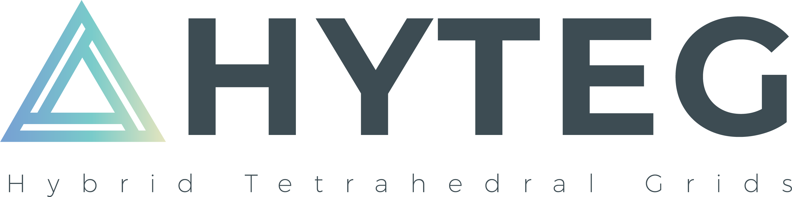

# Overview




## About HyTeG {#about-hyteg}

HyTeG (Hybrid Tetrahedral Grids) is a C++ framework for extreme-scale matrix-free finite element simulations strong focus on geometric multigrid.

For detailed information and references [have a look at the documentation](#documentation).

[TOC]

## Getting started {#getting-started}

### Quickstart

To build HyTeG, clone the [GitLab repository](https://i10git.cs.fau.de/hyteg/hyteg) via:

    $ git clone --recurse-submodules https://i10git.cs.fau.de/hyteg/hyteg.git

The option `--recurse-submodules` is **required** and will automatically initialize and clone 
[waLBerla](http://walberla.net "waLBerla homepage") and [Eigen](http://eigen.tuxfamily.org) as git submodules.

Create a build directory and invoke `cmake`:

    $ mkdir hyteg-build 
    $ cd hyteg-build
    $ cmake ../hyteg

CMake will then produce Makefiles for the included tests and applications. To build and run an application (e.g. a tutorial on isoviscous convection) invoke:

    hyteg-build $ cd tutorials/07_IsoviscousConvectionAnnulus
    hyteg-build/tutorials/07_IsoviscousConvectionAnnulus $ make
    hyteg-build/tutorials/07_IsoviscousConvectionAnnulus $ ./IsoviscousConvectionAnnulus

... or for a parallel run:

    hyteg-build/tutorials/07_IsoviscousConvectionAnnulus $ mpirun -np 4 ./IsoviscousConvectionAnnulus

### Prerequisites

Required:

* a C++17 compliant compiler (e.g. gcc, clang, Intel or MSVC)
* [CMake](https://cmake.org/ "CMake homepage") ( version >= 3.20 )

Automatically cloned via git submodules (NO need to install/download/clone these):

* [waLBerla](http://walberla.net "waLBerla homepage") for core functionalities (MPI communication, IO, logging, etc.)
* [Eigen](http://eigen.tuxfamily.org "Eigen homepage") for some linear algebra operations
* 🚧 ***ToDo***: generated kernels

Optional:

* MPI (e.g. [OpenMPI](https://www.open-mpi.org/ "OpenMPI homepage")) for parallel runs
* [ADIOS2](https://csmd.ornl.gov/software/adios2 "ADIOS2 homepage")  for efficient parallel I/O (CMake option `-DHYTEG_BUILD_WITH_ADIOS2=yes`)
* [PETSc](https://www.mcs.anl.gov/petsc/ "PETSc homepage")  for efficient coarse grid solvers (CMake option `-DHYTEG_BUILD_WITH_PETSC=yes`)
* [Trilinos](https://trilinos.github.io/ "Trilinos homepage") for efficient coarse grid solvers (CMake option `-DHYTEG_BUILD_WITH_TRILINOS=yes`)
* [ParMETIS](http://glaros.dtc.umn.edu/gkhome/metis/parmetis/overview "ParMETIS homepage") for high-quality load balancing
* [MPFR](https://www.mpfr.org/ "MPFR homepage") for emulated floating point datatypes (CMake option `-DHYTEG_BUILD_WITH_MPFR=yes`)

### Configuration options

🚧 ***ToDo***

### Structure and modules

🚧 ***ToDo***: short overview of directory structure

#### TerraNeo

🚧 ***ToDo***: move to structure and modules

TerraNeo is a module of HyTeG that is providing functionality for running mantle convection models from Geodynamics. As this is a specialised application, the module is not build by default. In order to compile the corresponding sources, tests and apps (re)run CMake with the following option

    -DHYTEG_TERRANEO_MODULE=yes

Please note that the module depends on [Boost](https://www.boost.org/) library, which is a header-only library.

CMake will search for installed Boost libraries. Should these not be found, you can tell it to download them also by setting

    -DHYTEG_DOWNLOAD_BOOST=yes

## Documentation {#documentation}

🚧 ***ToDo***: review / edit

The [Doxygen documentation](https://hyteg.pages.i10git.cs.fau.de/hyteg/index.html "HyTeG Doxygen") provides some basic 
tutorials for example applications.

If you are interested in more background information you may either have
a look at 

* our article [The HyTeG finite-element software framework for scalable multigrid solvers](https://www.tandfonline.com/doi/abs/10.1080/17445760.2018.1506453) - please cite this if you use the software


  ```
  @article{doi:10.1080/17445760.2018.1506453,
    author = {Nils Kohl and Dominik Thönnes and Daniel Drzisga and Dominik Bartuschat and Ulrich Rüde},
    title = {The {HyTeG} finite-element software framework for scalable multigrid solvers},
    journal = {International Journal of Parallel, Emergent and Distributed Systems},
    volume = {34},
    number = {5},
    pages = {477-496},
    year  = {2019},
    publisher = {Taylor & Francis},
    doi = {10.1080/17445760.2018.1506453}
  }
  ```
  
* the [TerraNeo web page](http://terraneo.fau.de) providing information and publications regarding the related research 
  project
  
* our article [TerraNeo—Mantle Convection Beyond a Trillion Degrees of Freedom](https://doi.org/10.1007/978-3-030-47956-5_19)
  summarizing recent achievements during the TerraNeo project

## Contributing

🚧 ***ToDo***

### Account

🚧 ***ToDo***

### Code Style

To keep our code consistently formatted, we use [ClangFormat](https://clang.llvm.org/docs/ClangFormat.html).
There is a `.clang-format` file located in the root directory where all the formatting rules are documented.
The rules can be automatically applied by using:

    clang-format -i $FileName

### Merge requests

A merge request (MR) can be in three different states:

1. Draft: Work in progress, not ready for review or merging.
   When opening a new MR, mark it as draft (by prefixing the title with "Draft: " or using the UI) unless it is already ready for review.
   Please formulate a descriptive title and provide a summary of your changes in the description.
2. Ready for review: Finished from the author's point of view.
   Remove the "Draft" flag to mark the MR as ready and ask a maintainer for review.
   *Every MR must have at least one approving review before it can be merged.*
3. Ready for merging: All work on this MR is done, it has been approved, all discussions are resolved and the CI passed.
   Thanks for your contribution to HyTeG!
   After making sure that "Delete source branch" is checked, you may press that Merge button.
   Please be aware that the CI checks the HEAD of your branch, not the result of the merge.
   In case the master and your branch diverged, it might be a good idea to rebase on the current master or merge the master into your branch so that the CI can check the combination of both changes.

### CCache

🚧 ***ToDo***: is that still true?

Due to the large amount of generated files it is advisable to activate ccache.
To do so use the CMake setting
    
    -DCMAKE_CXX_COMPILER_LAUNCHER=ccache

See also [this StackOverflow answer](https://stackoverflow.com/a/37828605).

## Contact

Nils Kohl `nils.kohl@lmu.de` or see here for a full list of core contributors 🚧 ***ToDo***

## License

This project is licensed under the GNU General Public License v3.0 or later. See 🚧 ***ToDo*** license file link

## Acknowledgements

Artwork by Manuel Weimann.
